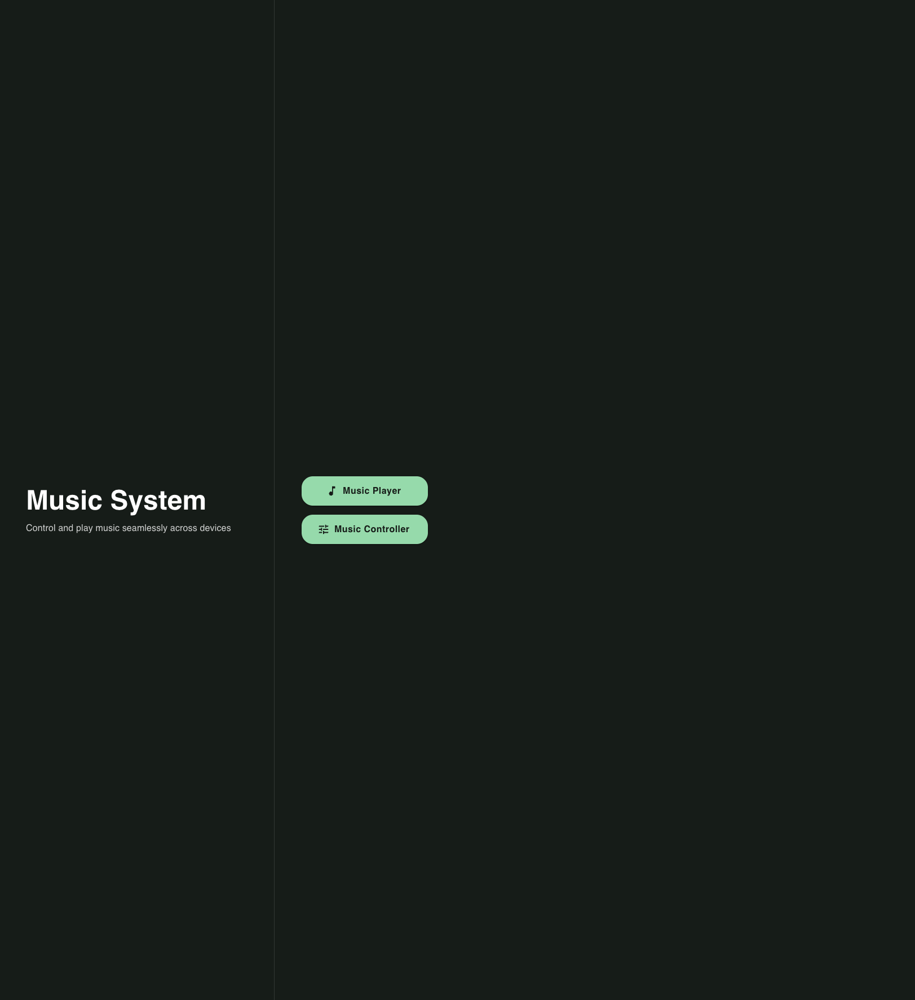
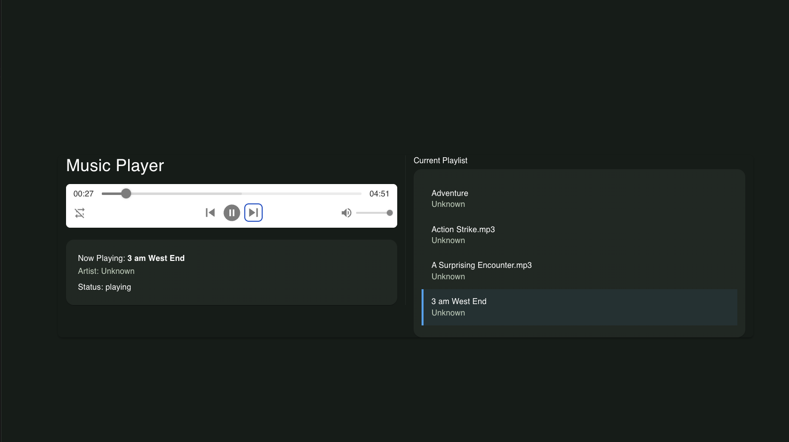
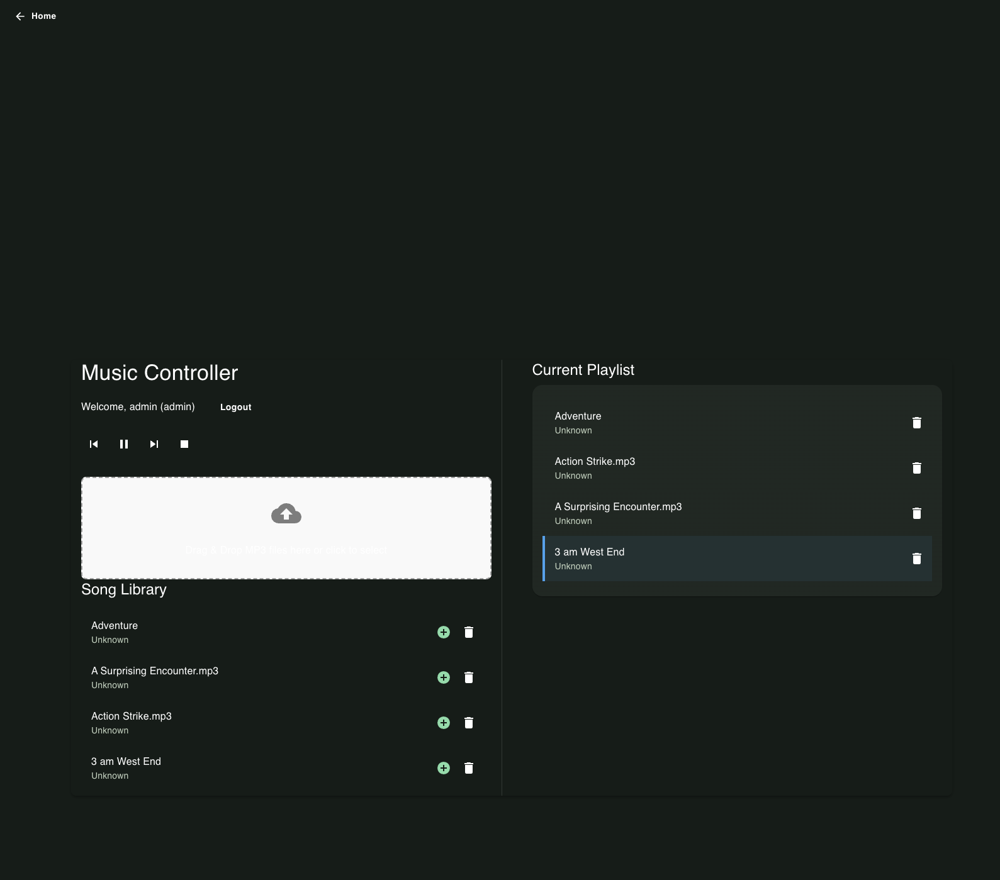
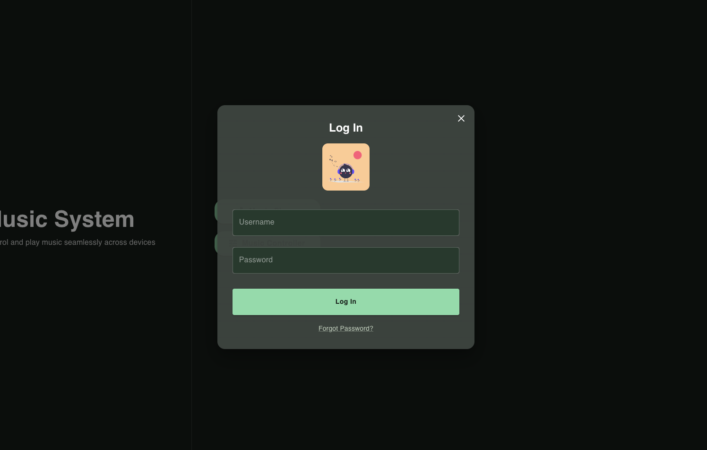
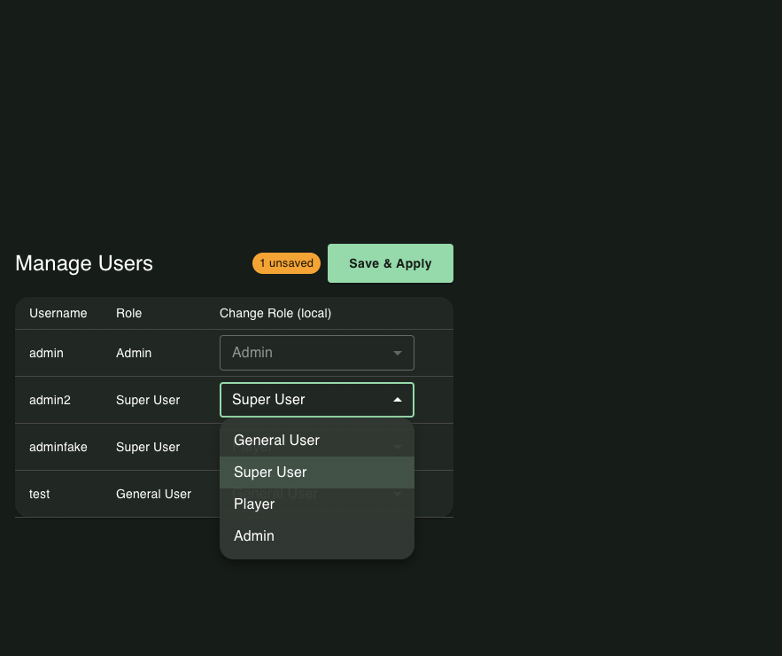

# 🎵 Ski Music - Real-Time Music Control System for Ice Rinks

**Ski Music** is a real-time music playback and control system built with **React**, **Redux**, **Node.js**, **Express**, and **WebSocket**.  
It allows multiple users to remotely control a shared music player via a web interface — perfect for use cases like ice rinks, gyms, cafés, and events.

This app supports role-based permission control to ensure only authorized users can perform certain operations. There are four user roles: `admin`, `super_user`, `player`, and `general_user`. Each role is associated with a set of capabilities:

- **admin**: Full access. Can upload songs, manage playlists, control playback, and manage user roles.
- **super_user / player**: Can add, remove, and reorder songs in the playlist, as well as control playback.
- **general_user**: Can add songs to the playlist, but cannot control playback or modify the queue.

This system ensures operational safety while enabling collaborative control over music playback in shared environments like ice rinks or public venues.
---

## ✨ Features

- 🎧 **Real-Time Playback** – Synchronizes music playback state across all clients using WebSocket
- 📱 **Remote Control Interface** – Control the music player from any device
- 📂 **Music Library Management** – Upload, delete, and browse music files
- ⏯ **Playback Controls** – Play, pause, skip next/previous tracks
- 📡 **Live State Updates** – Instantly broadcast player status to all connected users
- ☁ **Cloud Storage** – Store and retrieve music files from Supabase Storage with public URLs

---

## 🛠 Tech Stack

### Frontend
<p>
   &nbsp;&nbsp;&nbsp;
   &nbsp;&nbsp;&nbsp;
  
</p>
<p>
   &nbsp;&nbsp;&nbsp;
   &nbsp;&nbsp;&nbsp;
 
</p>

### Backend
<p>
   &nbsp;&nbsp;&nbsp;
   &nbsp;&nbsp;&nbsp;
  
</p>
<p>
   &nbsp;&nbsp;&nbsp;

  
</p>

## 📸 Screenshots

### 🎵 Home Page


### 🎵 Player Page


### 📱 Remote Control Page


### 📤 Upload Dialog


### 🛡️ Manage User Roles



---

## 📂 Project Structure

```plaintext
ski_music/
├── client/
│   ├── dist/
│   ├── node_modules/
│   ├── src/
│   │   ├── app/
│   │   │   └── store.js
│   │   ├── assets/
│   │   │   └── undraw_happy-music_name.svg
│   │   ├── components/
│   │   │   ├── BackButton.jsx
│   │   │   ├── CurrentPlaylist.jsx
│   │   │   ├── LoginModal.jsx
│   │   │   ├── SongLibrary.jsx
│   │   │   └── UploadZone.jsx
│   │   ├── contexts/
│   │   │   └── SocketContext.jsx
│   │   ├── features/
│   │   │   ├── auth/
│   │   │   │   └── authSlice.js
│   │   │   └── music/
│   │   │       ├── playerSlice.js
│   │   │       ├── playlistSlice.js
│   │   │       └── songLibrarySlice.js
│   │   ├── hooks/
│   │   │   └── usePlayerSocket.js
│   │   ├── pages/
│   │   │   ├── HomePage.jsx
│   │   │   ├── PlayerPage.jsx
│   │   │   └── RemotePage.jsx
│   │   ├── utils/
│   │   │   ├── apiClient.js
│   │   │   └── socketEvent.js
│   │   ├── App.jsx
│   │   ├── index.css
│   │   ├── main.jsx
│   │   └── theme.js
│   ├── .env
│   ├── .gitignore
│   ├── eslint.config.js
│   ├── index.html
│   ├── package-lock.json
│   ├── package.json
│   ├── vercel.json
│   └── vite.config.js
│
├── server/
│   ├── node_modules/
│   ├── src/
│   │   ├── api/
│   │   │   ├── authRoutes.js
│   │   │   ├── playerRoutes.js
│   │   │   ├── playlistRoutes.js
│   │   │   └── songsRoutes.js
│   │   ├── constants/
│   │   ├── controllers/
│   │   │   ├── authController.js
│   │   │   ├── playerController.js
│   │   │   ├── playlistController.js
│   │   │   ├── songsController.js
│   │   │   └── uploadController.js
│   │   ├── middleware/
│   │   ├── services/
│   │   │   ├── playerStateService.js
│   │   │   ├── postgresService.js
│   │   │   ├── socketService.js
│   │   │   └── supabaseClient.js
│   │   ├── socketEvent.js
│   │   └── server.js
│   ├── temp/
│   │   └── uploads/
│   │       ├── 1754169958878_Acti.mp3
│   │       ├── 1754169958889_Adva.mp3
│   │       ├── 1754271144441_Acti.mp3
│   │       ├── 1754271181033_3_am.mp3
│   │       └── 1754271181044_A_Su.mp3
│   ├── .env
│   ├── .gitignore
│   ├── package-lock.json
│   ├── package.json
│   ├── skating_rink.db
│   └── README.md
└── README.md
```

## 📦 Installation & Setup

> **Prerequisites:**  
> - Node.js (v18+)  
> - npm / yarn  
> - Supabase account (for database & storage)  
> - PostgreSQL connection string  
> - Render account (for backend deployment)  
> - Vercel account (for frontend deployment)

---
---

###  Clone the Repository
```bash
git clone https://github.com/chaohao1214/ski_music.git
cd ski_music
```

### 🖥️ Frontend Setup

1. Navigate to the `client` directory:
    ```bash
    cd client
    ```

2. Install dependencies:
    ```bash
    npm install
    # or
    yarn install
    ```

3. Create a `.env` file in the `client` directory and add:
    ```env
    VITE_API_URL=http://localhost:5000
    VITE_SOCKET_URL=http://localhost:5000
    ```

4. Start the development server:
    ```bash
    npm run dev
    # or
    yarn dev
    ```
    The frontend will usually be available at **http://localhost:5173** (Vite's default).

---

### ⚙️ Backend Setup

1. Navigate to the `server` directory:
    ```bash
    cd server
    ```

2. Install dependencies:
    ```bash
    npm install
    # or
    yarn install
    ```

3. Create a `.env` file in the `server` directory and add:
    ```env
    PORT=5000
    SUPABASE_URL=your_supabase_url
    SUPABASE_SERVICE_ROLE_KEY=your_supabase_service_role_key
    SUPABASE_BUCKET=your_bucket_name
    DATABASE_URL=your_postgres_connection
    ```

4. Start the development server:
    ```bash
    npm run dev
    # or
    yarn dev
    ```
    The backend server will typically start on the port specified in your `.env` file (default: **http://localhost:5000**).

---

### 🚀 Deployment

- **Frontend** → [Vercel](https://vercel.com/)  
- **Backend** → [Render](https://render.com/)  
- **Database & Storage** → [Supabase](https://supabase.com/)

---

## ✍️ Author

This project is primarily developed and maintained by: **Chaohao Zhu** 👋
